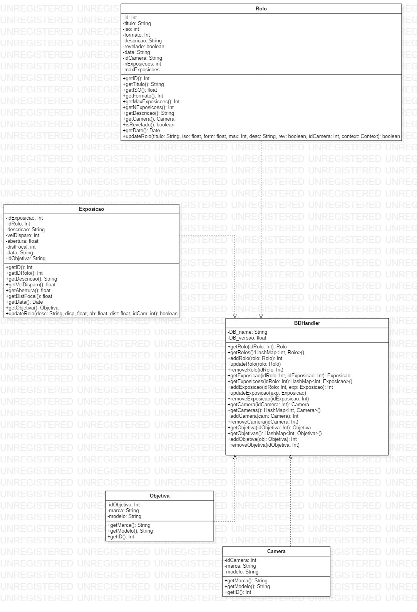

# [AnaLog](https://sites.google.com/view/lei-gps1819-g14/home) - Tabela de Conteúdos
- [Mockup Funcional](#mockup-funcional)
- [Diagrama de classes](#diagrama-de-classes)
- [Diagrama base de dados](#diagrama-base-de-dados)

# Mockup funcional
A mockup funcional na pode ser encontrada [aqui](https://xd.adobe.com/view/4fabe033-1328-4cc8-4b21-e9e4dc635762-399a/screen/073bf69b-7704-4bdf-bcc7-091cb8da44a3/AnaLog-Home-Rolos?fullscreen).

# Diagrama de classes

# Diagrama base de dados

# Projeto desenvolvido por:
- Ivo Henrique Rodrigues Casimiro (a21220708@isec.pt)
- Fernando Hugo Rocha Alves (a21200598@isec.pt)
- Marcos José Costa Gaspar (a21230462@isec.pt)
- Bruno Daniel Pereira Santos (a21190312@isec.pt)
- João Ferreira Oliveira (a21260748@isec.pt)
